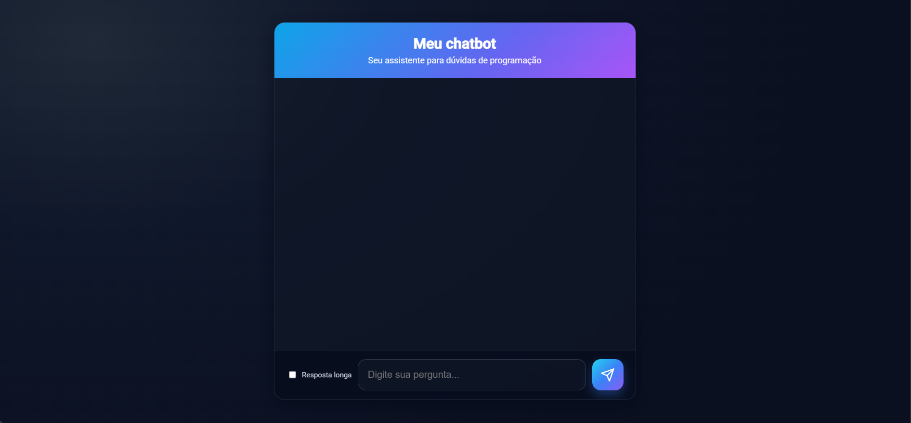

<!-- PORTFOLIO-FEATURED
title: Chatbot para Estudantes
description: Chatbot full-stack para auxiliar estudantes em dúvidas de programação e estudos gerais, com base local e fallback via OpenAI.
technologies: Python, FastAPI, JavaScript, HTML5, CSS3
demo: https://chatbot-ten-pi-24.vercel.app/
highlight: true
image: chatbot.png
-->

<p align="center">
  
</p>

# Chatbot para Estudantes

🔗 [Acesse o chatbot online](https://chatbot-ten-pi-24.vercel.app/)

Este projeto é um **chatbot simples e escalável**, projetado para ajudar estudantes com dúvidas sobre programação e outros tópicos de estudo. A arquitetura foi pensada para ser **fácil de manter, de baixo custo e com deploy simplificado na Vercel**.

---

## ✨ Visão Geral da Arquitetura

O projeto é dividido em duas camadas principais:

* **Frontend**: Interface de chat estática construída com HTML, CSS e JavaScript puros. Responsável por exibir a conversa e se comunicar com o backend.
* **Backend**: API em Python usando FastAPI. Contém a lógica do chatbot, processando as mensagens dos usuários.

### Fluxo de Funcionamento

1. O usuário envia uma mensagem pelo frontend.
2. O frontend faz uma requisição HTTP POST para o endpoint `/api/chat`.
3. O backend FastAPI recebe a mensagem.
4. A lógica do chatbot busca primeiro por uma resposta na **base de conhecimento local** (`chatbot.json`).
5. Se não houver resposta local, a API da OpenAI (ChatGPT) é usada como fallback.
6. A resposta é retornada em JSON para o frontend, que a exibe na tela.

---

## 🚀 Estrutura de Diretórios

```
chatbot/
│
├── api/
│   ├── main.py             # Entrada da API (FastAPI)
│   ├── chatbot.py          # Lógica do chatbot
│   ├── chatbot.json        # Base local de conhecimento
│   ├── config.py           # Configurações e variáveis de ambiente
│   ├── utils.py            # Funções auxiliares
│   └── __init__.py         # Marca 'api' como pacote Python
│
├── frontend/
│   ├── index.html          # Página de chat
│   ├── style.css           # Estilos
│   └── script.js           # Lógica do frontend
│
├── requirements.txt        # Dependências Python
├── vercel.json             # Configuração de deploy Vercel
├── .env                    # Variáveis de ambiente (não versionar)
├── .gitignore              # Arquivos/pastas ignorados pelo Git
└── README.md               # Este arquivo
```

---

## 🛠️ Como Executar Localmente

### Pré-requisitos

* [Python 3.9+](https://www.python.org/downloads/)
* Editor de código (ex.: VS Code)
* Conta OpenAI com API Key (opcional, apenas para fallback ChatGPT)

### Passo a Passo

1. **Clone o repositório**

```bash
git clone <url-do-seu-repositorio>
cd chatbot
```

2. **Crie e ative um ambiente virtual**

```bash
# Windows
python -m venv .venv
.\.venv\Scripts\activate

# macOS / Linux
python3 -m venv .venv
source .venv/bin/activate
```

3. **Instale as dependências**

```bash
pip install -r requirements.txt
```

4. **(Opcional) Configure a variável de ambiente da OpenAI**
   Crie um arquivo `.env` na raiz:

```
OPENAI_API_KEY="sk-...sua_chave_aqui"
```

5. **Inicie o servidor**

```bash
uvicorn api.main:app --reload
```

* Servidor rodando em `http://127.0.0.1:8000`.
* `--reload` reinicia automaticamente ao alterar o código.

6. **Abra o frontend**

* Navegue até `frontend/` e abra `index.html`.
* Recomenda-se usar **Live Server** no VS Code para evitar problemas de CORS.

---

## 🌐 Deploy na Vercel

O deploy é simples:

1. Suba o projeto para GitHub, GitLab ou Bitbucket.
2. No [Vercel](https://vercel.com), clique em "Add New Project" e importe o repositório.
3. A Vercel detecta automaticamente Python + FastAPI.
4. (Opcional) Adicione variáveis de ambiente (`OPENAI_API_KEY`).
5. Clique em **Deploy**. Pronto!

---

## 📝 Configurações e Variáveis

* `OPENAI_API_KEY`: chave da OpenAI (para fallback com ChatGPT)
* `frontend/script.js` detecta automaticamente se está em **localhost** ou produção.
* Backend permite CORS para `http://127.0.0.1:5500` e `http://localhost:5500`.

---

## 🔧 Funcionalidades Implementadas

* **Matching local**: busca exata, substring, fuzzy e embeddings (OpenAI opcional)
* **Fallback OpenAI** caso nenhuma resposta local seja encontrada
* **Streaming de respostas** (`/api/chat_stream`) para melhor UX em respostas longas
* **Toggle resposta curta/longa** e "Mostrar mais/menos"
* **Realce de código** com Prism.js no frontend
* **Auto-reload** do `chatbot.json` por mtime
* **Endpoint de diagnóstico**: `GET /api/kb_status`

### Ordem de Matching Local

1. Exato → 2. Substring → 3. Fuzzy (SequenceMatcher + Jaccard) → 4. Embeddings (cos \~0.82)

* Embeddings ativam apenas se `OPENAI_API_KEY` estiver definida.

---

## 🔗 Endpoints Úteis

* `POST /api/chat` → principal
* `POST /api/chat_stream` → streaming
* `GET /api/kb_status` → status da base local

---
